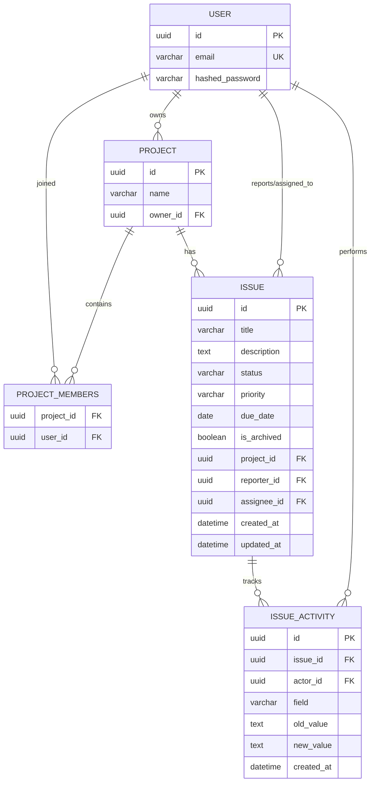
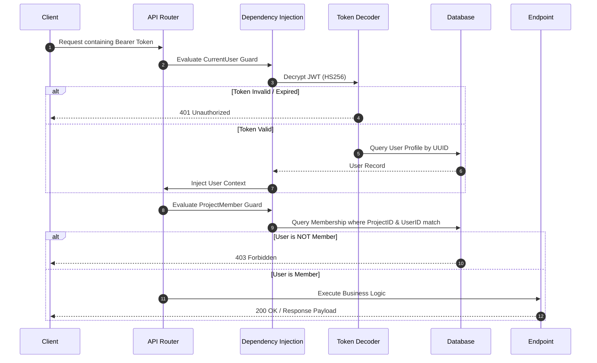

# 📖 Technical Documentation & Interview Preparation Guide
## Mini Issue Tracker API

This document serves as an exhaustive, professional-level architectural walkthrough and interview cheat sheet. It describes the design patterns, data flows, and technical choices implemented in the project.

---

## 1. 🚀 System Architecture & Technology Choices

### Framework: FastAPI
*   **Why Async?** FastAPI is built on Starlette and Uvicorn, utilizing Python's `asyncio`. This allows the server to handle thousands of concurrent requests by yielding control during slow I/O operations (like database queries), rather than blocking threads.
*   **Automatic OpenAPI (Swagger):** By defining data using Pydantic, the code generates OpenAPI 3.1 specifications dynamically, providing interactive documentation (`/docs`) out of the box.

### ORM: Tortoise ORM
*   **Why Tortoise?** Tortoise ORM is an easy-to-use, asyncio-native ORM modeled after Django's ORM syntax. It simplifies writing complex relational operations (like `prefetch_related` or `select_related`) while maintaining async compatibility.

### Authentication & Cryptography: Jose (JWT) & bcrypt
*   **Token-based Auth:** We use stateless JSON Web Tokens (JWT) signed with a symmetric secret key (`HS256`). This eliminates the need to query a session store on every API call.
*   **Password Hashing:** Passwords are never stored in plaintext. They are encrypted using `bcrypt` which enforces salting and key-stretching (work factor) to mitigate GPU-accelerated brute-force attacks.

---

## 2. 🗄️ Database Schema & Relationships (ER Model)

The database schema consists of 4 primary tables with strict relational integrity constraints:

*   **Cascading Deletes:** If a project is deleted, its issues and activities are cascaded (`on_delete=CASCADE`).
*   **Set-Null Nullable Constraints:** If a user is deleted, any issue assigned to them has its `assignee_id` set to `NULL` (`on_delete=SET_NULL`), preventing broken references.

---

## 3. 🔄 Critical Data Flows

### A. Authentication & Access Guard Flow

---

### B. Write-Audit Lifecycle (`PATCH /issues`)
Whenever an issue is updated, we track changes dynamically:
1.  **Read Original:** Fetch the original issue from the database.
2.  **Compare Properties:** Inspect fields (`status`, `priority`, `assignee`, etc.) comparing the current Pydantic request body fields with the database values.
3.  **Generate Audit Logs:** For every modified field, instantiate an `IssueActivity` model containing:
    *   `field` (e.g., `"status"`)
    *   `old_value` (e.g., `"TODO"`)
    *   `new_value` (e.g., `"IN_PROGRESS"`)
    *   `actor` (current logged-in user object)
4.  **Save Atomic Transaction:** Commit the updated Issue object and the newly generated activity logs in a single atomic database operation.

---

## 4. 💬 Common Technical Interview Questions & Answers

### Q1: Why did you choose stateless JWTs over session cookies?
> **Answer:** "Stateless JWT tokens are stored on the client-side. The server only needs to verify the cryptographic signature of the token to authenticate the user, which requires zero database queries or memory lookup. This makes horizontal scaling much easier, as any node in the backend cluster can verify a request's validity without sharing session state."

### Q2: What security risks did you address on Auth endpoints?
> **Answer:** "Authentication endpoints are vulnerable to brute-force and credential stuffing attacks. To address this, I used **SlowAPI** to rate-limit requests. Register is limited to 10 requests per minute and Login is limited to 20 requests per minute. If a script tries to spam credentials, the API instantly cuts them off with a `429 Too Many Requests` error."

### Q3: Why do we use Soft Delete instead of Hard Delete?
> **Answer:** "In a collaborative platform, hard-deleting issues instantly breaks historical reports, activity audits, and user references. Soft-deleting by switching `is_archived = True` ensures database integrity, maintains the audit history, and allows us to easily implement 'Restore/Trash' features in the future. All active queries simply filter for `is_archived=False`."

### Q4: If the issue count grows to 10 million rows, how will this design scale? What are the bottlenecks?
> **Answer:** 
> 1.  **In-Memory Sorting Bottleneck:** "Currently, sorting by custom fields like `status` or `priority` is done in Python after reading all issues. For 10 million rows, this would exhaust server RAM. To scale, we would store status/priority weights as integers in the database and use index-backed database-level sorting."
> 2.  **Database Indexing:** "We would add composite indexes to speed up the filtering queries, such as a composite index on `(project_id, is_archived, due_date)` so the database doesn't perform slow full-table scans."
